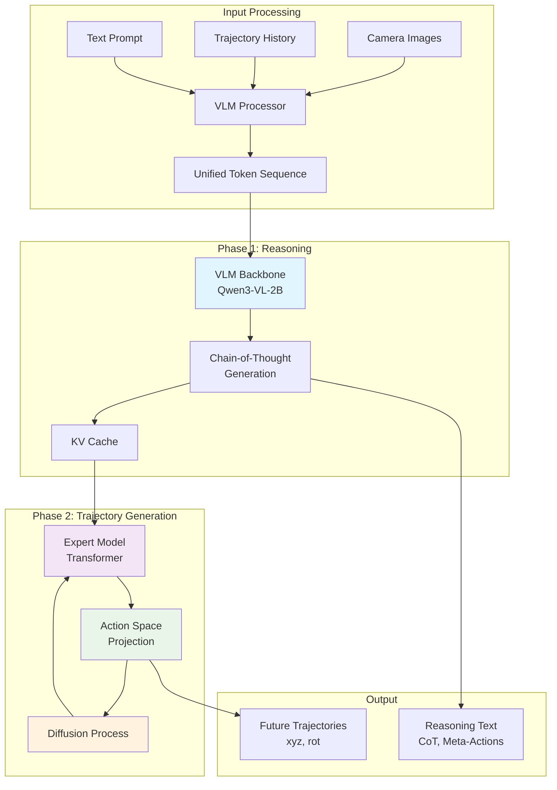
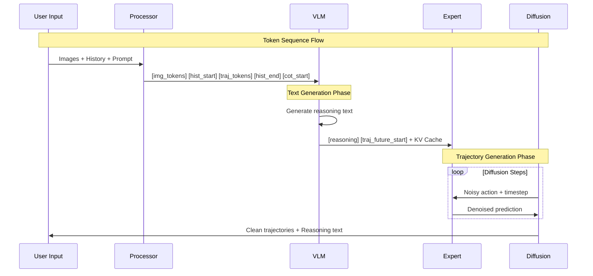
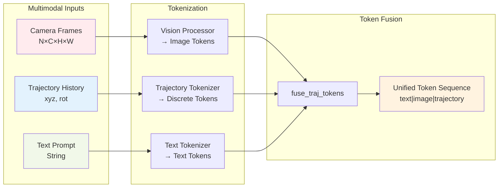
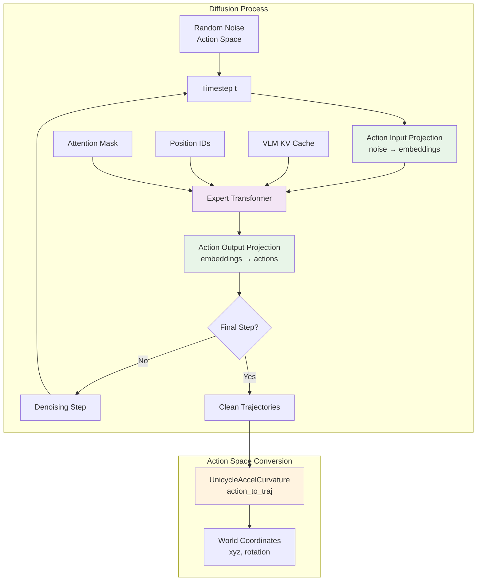
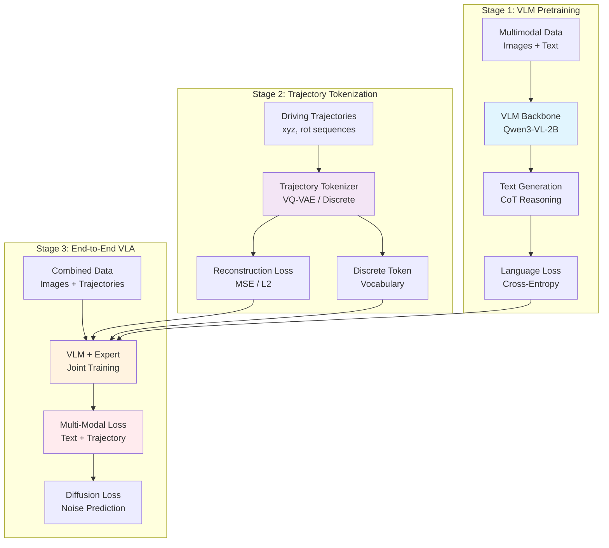
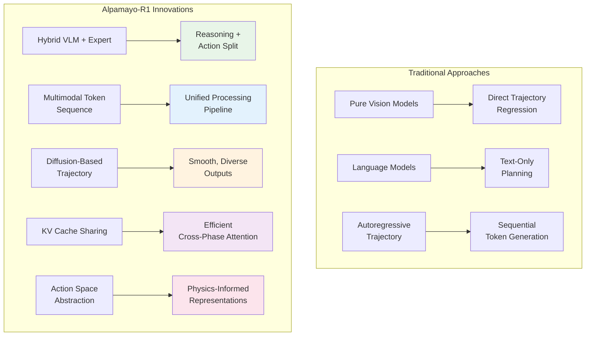

# Alpamayo-R1 Model Architecture Documentation

## Overview

Alpamayo-R1 is a **Vision-Language-Action (VLA) model** designed for autonomous driving that combines reasoning capabilities with trajectory generation. The model uses a hybrid architecture that integrates:

1. **Vision-Language Model (VLM)** - Processes camera images and generates Chain-of-Thought reasoning
2. **Expert Model** - Specialized transformer for trajectory/action prediction
3. **Diffusion Model** - Generates smooth, realistic driving trajectories
4. **Action Space** - Converts between trajectory coordinates and action representations

### High-Level Architecture



---

## Core Architecture Components

### 1. Vision-Language Model (VLM) Backbone

**Purpose**: Process multimodal input (images + text) and generate reasoning

**Key Features**:
- Based on **Qwen3-VL-2B-Instruct** architecture
- Processes camera frames and text simultaneously
- Generates Chain-of-Thought (CoT) reasoning before trajectory prediction
- Uses special tokens to structure the output sequence

**Input Processing**:
```python
# Image + Text tokenization
messages = [
    {"role": "system", "content": "You are a driving assistant..."},
    {"role": "user", "content": [images] + [trajectory_history] + [prompt]},
    {"role": "assistant", "content": "<|cot_start|>"}
]
```

### 2. Expert Model

**Purpose**: Specialized transformer for trajectory generation

**Architecture**:
- Transformer decoder (same architecture as VLM text component)
- Separate from VLM to allow specialized training on trajectory data
- Uses **non-causal attention** for better trajectory modeling
- Shares KV cache with VLM for efficiency

**Key Components**:
- `action_in_proj`: Projects noisy actions to expert token embeddings
- `action_out_proj`: Projects expert outputs back to action space
- Processes diffusion timesteps alongside trajectory tokens

### 3. Diffusion Model

**Purpose**: Generate smooth, realistic trajectory samples

**Type**: **Flow Matching** diffusion (see `flow_matching.py`)
- More stable than traditional DDPM
- Better for continuous trajectory generation
- Supports multiple trajectory samples per input

**Process**:
1. Start with noise in action space
2. Expert model provides denoising at each timestep
3. Iteratively refine to clean trajectory
4. Convert back to world coordinates

### 4. Action Space

**Purpose**: Convert between world coordinates and action representations

**Implementation**: `UnicycleAccelCurvature`
- Represents driving actions as acceleration and curvature
- More natural for vehicle dynamics than raw coordinates
- Enables smooth trajectory generation

**Transformations**:
- `traj_to_action()`: World coords → Action space
- `action_to_traj()`: Action space → World coords

---

## Token System & Special Tokens

### Special Token Categories

The model uses an extensive set of special tokens to structure multimodal sequences:

```python
SPECIAL_TOKENS = {
    # Conversation flow
    "prompt_start", "prompt_end",
    "answer_start", "answer_end",
    "question_start", "question_end",

    # Vision tokens
    "image_start", "image_pre_tkn", "image_end", "image_pad",

    # Trajectory tokens
    "traj_history_start", "traj_history_end", "traj_history_pre_tkn",
    "traj_future_start", "traj_future_end", "traj_future_pre_tkn",
    "traj_history", "traj_future",

    # Reasoning tokens
    "cot_start", "cot_end",           # Chain of Thought
    "meta_action_start", "meta_action_end",

    # Additional modalities
    "vectorized_wm_start", "vectorized_wm_end",  # Vectorized world model
    "route_start", "route_end", "route_pad",     # Route planning
}
```

### Token Flow During Generation



**Key Points**:
- `<|traj_future_start|>` serves as EOS for text generation
- After this token, model switches from text to trajectory generation mode
- Discrete trajectory tokens (`<i0>`, `<i1>`, etc.) represent quantized actions

---

## Data Flow Architecture

### Input Processing Pipeline



**Processing Steps**:

1. **Image Processing**:
   ```python
   # Convert images to patches/tokens
   frames → processor.apply_chat_template() → image_tokens
   ```

2. **Trajectory History Tokenization**:
   ```python
   # Convert past trajectory to tokens
   ego_history_xyz, ego_history_rot → traj_tokenizer.encode() → history_tokens
   ```

3. **Token Fusion**:
   ```python
   # Combine all modalities into unified sequence
   input_ids = fuse_traj_tokens(input_ids, traj_data)
   # Result: [text, image, trajectory_history] tokens
   ```

### Inference Pipeline

#### Phase 1: VLM Generation (Text Reasoning)

```python
# Generate Chain-of-Thought reasoning
vlm_outputs = self.vlm.generate(
    input_ids=input_ids,
    stopping_criteria=[StopAfterEOS(eos_token_id="<|traj_future_start|>")],
    logits_processor=[ExpertLogitsProcessor()],  # Mask trajectory tokens
    max_new_tokens=256,
    temperature=0.6,
    top_p=0.98
)
```

**Key Features**:
- **ExpertLogitsProcessor**: Masks out trajectory tokens during text generation
- **Custom Stopping**: Stops at `<|traj_future_start|>` token
- **KV Cache**: Stores attention states for reuse in Phase 2

#### Phase 2: Expert Model + Diffusion (Trajectory Generation)



**Code Implementation**:
```python
# Define denoising function
def step_fn(x: torch.Tensor, t: torch.Tensor) -> torch.Tensor:
    # Project noisy action to token embeddings
    future_token_embeds = self.action_in_proj(x, t)

    # Run expert model with cached KV from VLM
    expert_out = self.expert(
        inputs_embeds=future_token_embeds,
        past_key_values=vlm_cache,  # Reuse VLM attention
        attention_mask=attention_mask,
        position_ids=position_ids
    )

    # Project back to action space
    pred = self.action_out_proj(expert_out.last_hidden_state)
    return pred

# Run diffusion sampling
trajectories = self.diffusion.sample(
    batch_size=batch_size,
    step_fn=step_fn,
    num_samples=num_traj_samples
)
```

**Advanced Features**:
- **KV Cache Reuse**: Expert model continues from VLM's attention states
- **Position ID Management**: Handles proper positional encoding across phases
- **Multiple Samples**: Generate diverse trajectory candidates
- **Non-Causal Attention**: Expert uses bidirectional attention for trajectory tokens

### Output Processing

```python
# Convert action space back to world coordinates
pred_xyz, pred_rot = self.action_space.action_to_traj(
    sampled_action, hist_xyz_rep, hist_rot_rep
)

# Extract generated reasoning text
extra = extract_text_tokens(tokenizer, vlm_outputs.sequences)
# Returns: {"cot": [...], "meta_action": [...], "answer": [...]}
```

---

## Training Process

### Multi-Stage Training Strategy



**Note**: Training code not included in this release, but architecture suggests:

1. **Stage 1: VLM Pretraining**
   - Train vision-language backbone on multimodal reasoning tasks
   - Learn to process images and generate coherent text

2. **Stage 2: Trajectory Tokenizer Training**
   - Train discrete tokenizers to encode/decode trajectories
   - Learn meaningful action space representations

3. **Stage 3: End-to-End VLA Training**
   - Jointly train VLM + Expert + Diffusion on driving data
   - Learn to coordinate reasoning with trajectory generation

### Loss Components (Inferred)

```python
# Likely training losses:
text_loss = cross_entropy(vlm_text_logits, target_text)
traj_loss = diffusion_loss(predicted_noise, target_noise)
action_loss = mse(predicted_actions, target_actions)
total_loss = α*text_loss + β*traj_loss + γ*action_loss
```

---

## Configuration System

### AlpamayoR1Config

```python
config = AlpamayoR1Config(
    # Diffusion settings
    diffusion_cfg={
        "_target_": "alpamayo_r1.diffusion.flow_matching.FlowMatchingDiffusion",
        "num_steps": 50,
        "sigma_min": 1e-4
    },

    # Action space configuration
    action_space_cfg={
        "_target_": "alpamayo_r1.action_space.unicycle_accel_curvature.UnicycleAccelCurvature",
        "dt": 0.1,
        "horizon": 4.8
    },

    # Expert model settings
    expert_cfg={
        "num_hidden_layers": 12,
        "hidden_size": 2048,
        "num_attention_heads": 16
    },

    # Projection layers
    action_in_proj_cfg={"_target_": "alpamayo_r1.models.action_in_proj.ActionInProj"},
    action_out_proj_cfg={"_target_": "torch.nn.Linear"},

    # Model behavior
    expert_non_causal_attention=True,  # Use bidirectional attention
    keep_same_dtype=True  # Match expert dtype to VLM
)
```

---

## Key Design Decisions & Innovations

### Architecture Innovation Comparison



### Core Design Benefits

1. **Hybrid Architecture Benefits**
   - **Reasoning + Action Split**: VLM handles complex reasoning (language domain), Expert specializes in trajectory generation (action domain)
   - **Independent Optimization**: Allows specialized training for each component

2. **Token-Based Multimodal Integration**
   - **Unified Token Sequence**: All modalities (vision, language, trajectory) in single sequence
   - **End-to-End Training**: Enables joint optimization across modalities
   - **Special Token Control**: Provides structure and control flow

3. **Diffusion for Trajectory Generation**
   - **Smoother Trajectories**: Better than autoregressive for continuous outputs
   - **Multiple Samples**: Can generate diverse trajectory candidates
   - **Physical Constraints**: Better handles trajectory dynamics

4. **KV Cache Sharing**
   - **Efficiency Innovation**: VLM reasoning states reused by Expert model
   - **Context Preservation**: Enables longer context understanding in trajectory generation

5. **Action Space Abstraction**
   - **Natural Representation**: UnicycleAccelCurvature for vehicle dynamics
   - **Physical Constraints**: Easier to enforce realistic driving behavior

---

## Performance Characteristics

### Model Scale
- **VLM Backbone**: ~2B parameters (Qwen3-VL base)
- **Expert Model**: ~1B parameters (configurable)
- **Total Model**: ~10B parameters (Alpamayo-R1-10B)

### Inference Speed
- **Phase 1 (Reasoning)**: ~256 tokens @ standard LLM speed
- **Phase 2 (Trajectory)**: ~48 trajectory tokens via diffusion
- **Total Latency**: Depends on diffusion steps (typically 20-50)

### Memory Requirements
- **Training**: Requires substantial GPU memory for 10B model
- **Inference**: Optimized with KV cache reuse
- **Flash Attention**: Used for memory-efficient attention computation

---

## Usage Examples

### Basic Inference

```python
from alpamayo_r1.models.alpamayo_r1 import AlpamayoR1
from alpamayo_r1 import helper

# Load model
model = AlpamayoR1.from_pretrained("nvidia/Alpamayo-R1-10B", dtype=torch.bfloat16)
model = model.to("cuda")

# Prepare input
processor = helper.get_processor(model.tokenizer)
messages = helper.create_message(image_frames)
inputs = processor.apply_chat_template(messages, return_tensors="pt")

# Generate trajectories with reasoning
pred_xyz, pred_rot, extra = model.sample_trajectories_from_data_with_vlm_rollout(
    data={
        "tokenized_data": inputs,
        "ego_history_xyz": history_xyz,
        "ego_history_rot": history_rot
    },
    num_traj_samples=6,
    temperature=0.6,
    top_p=0.98,
    return_extra=True
)

# Extract reasoning
print("Chain-of-Thought:", extra["cot"][0])
print("Predicted trajectory shape:", pred_xyz.shape)
```

### Advanced Configuration

```python
# Custom diffusion parameters
diffusion_kwargs = {
    "num_steps": 20,  # Faster sampling
    "solver": "euler"
}

# Generate with custom settings
pred_xyz, pred_rot = model.sample_trajectories_from_data_with_vlm_rollout(
    data=model_inputs,
    num_traj_samples=12,      # More diversity
    num_traj_sets=2,          # Multiple trajectory sets
    diffusion_kwargs=diffusion_kwargs,
    max_generation_length=512  # Longer reasoning
)
```

---

## File Structure Reference

```
src/alpamayo_r1/
├── models/
│   ├── alpamayo_r1.py          # Main model class
│   ├── base_model.py           # ReasoningVLA base class
│   ├── token_utils.py          # Special token utilities
│   ├── delta_tokenizer.py      # Trajectory tokenization
│   └── action_in_proj.py       # Action space projections
├── diffusion/
│   ├── base.py                 # Base diffusion interface
│   └── flow_matching.py        # Flow matching implementation
├── action_space/
│   ├── action_space.py         # Abstract action space
│   ├── unicycle_accel_curvature.py  # Vehicle dynamics
│   └── utils.py                # Action space utilities
├── geometry/
│   └── rotation.py             # Rotation utilities
├── config.py                   # Model configuration
├── helper.py                   # Inference utilities
└── test_inference.py           # Example inference script
```

---

## Future Extensions

The architecture is designed to support:

- **Additional Modalities**: LiDAR, radar, maps via new special tokens
- **Longer Horizons**: Extended trajectory prediction through config changes
- **Multi-Agent**: Reasoning about other vehicles and interactions
- **Hierarchical Planning**: Route planning + local trajectory generation
- **Online Learning**: Adaptation to new driving scenarios

This modular design makes Alpamayo-R1 a flexible foundation for autonomous driving research and development.